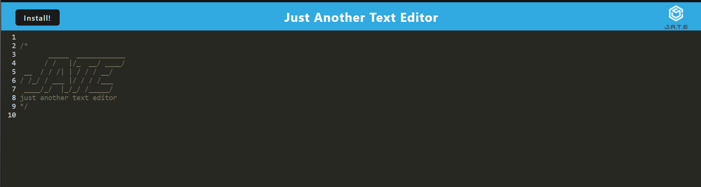
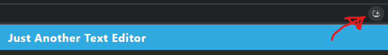

# PWA-Text-Editor

## Description
This application is meant to be a Progressive Web Application that provides flexibility in utilization with the Webpack Plug-In by bundling up files together to help with caching and providing fast load times regardless of connection. 

## Usage
Needing a text editor that runs in the browser or on the go, online or offline? This apps got you covered!

Here's how to use the application:

1.) Open the Text Editor Webpage - https://text-editor-19-67baccfe6e23.herokuapp.com 

2.) Type anything you'd like, the app saves your notes by clicking anywhere outside the terminal and will color code your JavaScript notes!

3.) Do you constantly get disconnected or kicked offline? This application can save your notes while being utilized offline!

4.) Wishing you could save this application locally? Do we have great news for you as you can by clicking on the little icon to the right of the URL:

## Credits
Starter code provided by the University of Utah and improved by AegeanGrey/Todd D.

## License
MIT License

Copyright (c) 2023 Todd D.

Permission is hereby granted, free of charge, to any person obtaining a copy of this software and associated documentation files (the "Software"), to deal in the Software without restriction, including without limitation the rights to use, copy, modify, merge, publish, distribute, sublicense, and/or sell copies of the Software, and to permit persons to whom the Software is furnished to do so, subject to the following conditions:

The above copyright notice and this permission notice shall be included in all copies or substantial portions of the Software.

THE SOFTWARE IS PROVIDED "AS IS", WITHOUT WARRANTY OF ANY KIND, EXPRESS OR IMPLIED, INCLUDING BUT NOT LIMITED TO THE WARRANTIES OF MERCHANTABILITY, FITNESS FOR A PARTICULAR PURPOSE AND NONINFRINGEMENT. IN NO EVENT SHALL THE AUTHORS OR COPYRIGHT HOLDERS BE LIABLE FOR ANY CLAIM, DAMAGES OR OTHER LIABILITY, WHETHER IN AN ACTION OF CONTRACT, TORT OR OTHERWISE, ARISING FROM, OUT OF OR IN CONNECTION WITH THE SOFTWARE OR THE USE OR OTHER DEALINGS IN THE SOFTWARE.